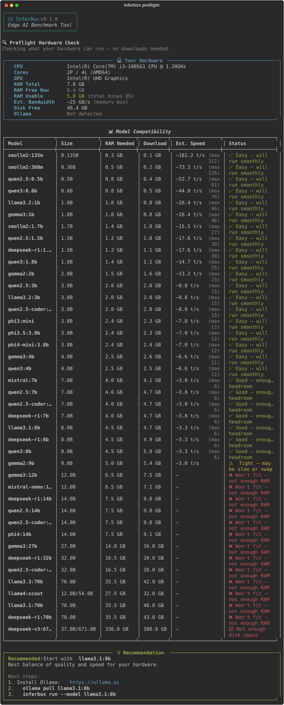

# 🔬 InferBox

**The only tool that benchmarks local LLMs across speed, memory, power, AND quality — one command, one score.**

[](https://github.com/chandanpandeys/inferbox/actions/workflows/ci.yml)
[](https://python.org)
[](LICENSE)

---

<p align="center">
  
</p>

> **Don't know if your laptop or edge device can run a local LLM?** Try `inferbox preflight` — it checks your hardware specs, detects your NPU and memory bandwidth ceiling in 5 seconds, **without downloading any weights**.

## Why InferBox?

Most LLM benchmark tools only measure raw synthetic tokens-per-second. None of them answer the questions that actually matter on laptops, edge devices, and consumer hardware:

- 🏎️ **How fast is it really?** Split generation tok/s vs. prompt processing (TTFT), plus thermal throttle detection
- 🧠 **Reasoning models?** Automatic extraction and tracking of `<think>` reasoning tokens (DeepSeek R1, QwQ)
- 💾 **Will it fit?** Peak RAM, model footprint, utilization pressure, and MoE active vs. total parameter sizing
- ⚡ **What about my battery?** Microsecond-precision power monitoring and per-token energy cost in millijoules (mJ)
- 🌊 **Memory Bandwidth Limit?** Calculates your hardware's theoretical memory bus speed limit vs. actual throughput
- 🎯 **Is it smart enough?** Mini-MMLU (100 questions) + mini-HumanEval (20 coding problems)
- 🏆 **Bottom line?** A single **Edge Score** out of 100

### InferBox vs. Alternatives

| Feature | InferBox | llmBench | whichllm | aidatatools/ollama-benchmark | vLLM bench |
|:--------|:--------:|:--------:|:--------:|:----------------------------:|:----------:|
| Generation Speed (Tok/s) | ✅ | ✅ | ❌ | ✅ | ✅ |
| Prompt Eval / TTFT | ✅ | ✅ | ❌ | ❌ | ✅ |
| Reasoning Token Telemetry | ✅ | ❌ | ❌ | ❌ | ❌ |
| Thermal Throttle Profiling | ✅ | ✅ | ❌ | ❌ | ❌ |
| Memory Profiling | ✅ | ✅ | Partial | ❌ | ❌ |
| Power & Energy Measurement | ✅ | ✅ | ❌ | ❌ | ❌ |
| Quality Eval (MMLU + Code) | ✅ | ❌ | ❌ | ❌ | ❌ |
| Composite Edge Score (0-100) | ✅ | ❌ | ❌ | ❌ | ❌ |
| Preflight Check (No downloads) | ✅ | ❌ | ✅ | ❌ | ❌ |
| MoE Active Weight Aware | ✅ | Partial | Partial | ❌ | ❌ |
| Cross-Platform (Win/Mac/Linux) | ✅ | Linux-first | Web/CLI | ✅ | Linux only |
| `pip install` | ✅ | Source | Source | ✅ | ✅ |

## Quick Start

```bash
pip install inferbox
inferbox preflight          # Check what your hardware can run (no downloads!)
inferbox run --model qwen2.5:3b   # Full benchmark → Edge Score
```

## What It Measures

| Category | Metrics |
|:---|:---|
| 🏎️ **Speed** | Generation Tok/s, Prompt Tok/s, TTFT, sustained performance, thermal throttling, reasoning tokens |
| 💾 **Memory** | Peak RAM, model footprint, RAM utilization %, MoE active parameter footprint |
| ⚡ **Power** | Watts consumed, tok/s per watt, energy per token (mJ) |
| 🎯 **Quality** | mini-MMLU (100 questions), mini-HumanEval (20 coding problems) |

> **⚠️ Security Warning:** The `mini-HumanEval` benchmark executes Python code generated by the LLM locally on your machine using a 10-second `subprocess` timeout. While standard models are safe, do not run the quality benchmark on untrusted, potentially malicious/poisoned models. Use `--only speed` to skip code execution.

## Commands

```bash
# Check if your hardware can run LLMs (no Ollama needed!)
inferbox preflight

# Check a specific model
inferbox preflight --model phi4:14b

# Full benchmark
inferbox run --model qwen2.5-coder:3b

# Quick 1-minute benchmark (fewer runs, no quality suite)
inferbox run --model qwen2.5:3b --quick

# Speed-only benchmark
inferbox run --model qwen2.5:3b --only speed

# Compare models side-by-side
inferbox compare --models "qwen2.5:3b,llama3.2:3b"

# View your benchmark history
inferbox leaderboard

# Show hardware info + backend status
inferbox info

# Export results
inferbox run --model qwen2.5:3b --export json -o results.json
inferbox run --model qwen2.5:3b --export markdown -o results.md
```

## Preflight Check

Don't know which model to run? `inferbox preflight` checks your CPU, GPU, NPU, and memory bandwidth, telling you what fits — **without downloading anything**:

```
💻 Your Hardware:
  CPU:             Apple M4 Pro
  Cores:           12P / 12L (arm64)
  GPU:             Apple M4 Pro (16-core)
  NPU / AI Engine: Apple Neural Engine (16-core)
  RAM Total:       36.0 GB
  RAM Usable:      34.0 GB (total minus OS)
  Est. Bandwidth:  ~273 GB/s (memory bus)
  Disk Free:       480.2 GB
  Ollama:          Running ✓

📊 Model Compatibility:
 Model                  Size        RAM Needed  Download  Est. Speed       Status
──────────────────────────────────────────────────────────────────────────────────────────
 smollm2:135m           0.135B         0.3 GB    0.1 GB   ~145.0 t/s       ✅ Easy — will run smoothly
 qwen2.5:0.5b           0.5B           0.7 GB    0.4 GB   ~120.0 t/s       ✅ Easy — will run smoothly
 llama3.2:1b            1.0B           1.0 GB    0.8 GB   ~95.0 t/s        ✅ Easy — will run smoothly
 qwen2.5:3b             3.0B           2.0 GB    2.0 GB   ~58.0 t/s        ✅ Easy — will run smoothly
 phi4-mini:3.8b         3.8B           2.4 GB    2.4 GB   ~45.0 t/s        ✅ Easy — will run smoothly
 llama3.1:8b            8.0B           4.5 GB    4.7 GB   ~28.0 t/s        ✅ Good — enough headroom
 deepseek-r1:14b        14.0B          7.5 GB    9.0 GB   ~16.0 t/s        ✅ Good — enough headroom
 llama4:scout           12B/54B MoE   27.5 GB   32.0 GB   ~22.0 t/s        ✅ Good — enough headroom
 llama3.3:70b           70.0B         35.5 GB   42.0 GB   ~4.5 t/s         ⚠️ Tight — may be slow or swap
 deepseek-v3:671b       37B/671B MoE 336.0 GB  380.0 GB   —                ❌ Won't fit — not enough RAM

💡 Recommended: Start with deepseek-r1:14b
```

## Requirements

- **Python 3.10+**
- **Ollama** running locally ([install](https://ollama.ai)) — *for benchmarks only*
- A model pulled: `ollama pull qwen2.5:3b`

> **Note:** `inferbox preflight` and `inferbox info` work without Ollama.

## Installation

```bash
# From PyPI
pip install inferbox

# From source
git clone https://github.com/chandanpandeys/inferbox.git
cd inferbox
pip install -e .

# With llama.cpp support
pip install -e ".[llamacpp]"
```

## Sample Output

```
╭──────────────────────────────────────────────╮
│           🔬 InferBox v0.1.0                │
│          Edge AI Benchmark Tool              │
╰──────────────────────────────────────────────╯

📦 Model: deepseek-r1:7b (Q4_K_M)
💻 Hardware: AMD Ryzen AI 9 HX 370 | x86_64 | 32.0GB RAM | AMD XDNA 2 NPU (50+ TOPS)
🔌 Backend: ollama

┌──────────────────┬────────────┬─────────┐
│ Metric           │ Value      │ Rating  │
├──────────────────┼────────────┼─────────┤
│ Tok/s (gen)      │ 28.4       │ ⭐⭐⭐⭐⭐ │
│ Tok/s (prompt)   │ 142.0      │ ⭐⭐⭐⭐⭐ │
│ TTFT             │ 0.38s      │ ⭐⭐⭐⭐⭐ │
│ Reasoning Tokens │ 412 tokens │   🧠    │
│ Peak RAM         │ 5.2 GB     │ ⭐⭐⭐⭐  │
│ Power            │ 18.5 W     │ ⭐⭐⭐⭐  │
│ Tok/s/W          │ 1.54       │ ⭐⭐⭐⭐  │
│ mini-MMLU (100q) │ 71.0%      │ ⭐⭐⭐⭐⭐ │
│ mini-HumanEval   │ 55.0%      │ ⭐⭐⭐⭐⭐ │
└──────────────────┴────────────┴─────────┘

🏆 Edge Score: 82/100
```

## Supported Models

InferBox includes pre-computed architecture specs for **38+ leading local models**:

| Family | Models |
|:-------|:-------|
| **Qwen 2.5 & 3** | 0.5b, 0.6b, 1.5b, 1.8b, 3b, 4b, 7b, 8b, 14b, 32b, 72b, coder:3b, coder:7b, coder:14b, coder:32b |
| **Llama 3.x & 4** | 3.2:1b, 3.2:3b, 3.1:8b, 3.1:70b, 3.3:70b, 4:scout (MoE) |
| **DeepSeek R1 & V3** | r1:1.5b, r1:7b, r1:8b, r1:14b, r1:32b, r1:70b, v3:671b (MoE) |
| **Phi-3.5 & 4** | phi3:mini (3.8b), phi3.5:3.8b, phi4-mini:3.8b, phi4:14b |
| **Gemma 2 & 3** | gemma2:2b, gemma2:9b, gemma3:1b, gemma3:4b, gemma3:12b, gemma3:27b |
| **SmolLM2** | smollm2:135m, smollm2:360m, smollm2:1.7b |
| **Mistral** | mistral:7b, mistral-nemo:12b |

Any Ollama or llama.cpp model can be benchmarked — the database is used for preflight sizing.

## Cross-Platform

InferBox is pure Python — works on **Windows**, **Linux**, and **macOS** out of the box with auto-detection for Apple Silicon M-series (M1-M4), Qualcomm Snapdragon X, Intel Lunar Lake / Arrow Lake, and AMD Ryzen AI (Strix Point/Halo).

## Contributing

We welcome contributions! See [CONTRIBUTING.md](CONTRIBUTING.md) for guidelines.

## License

Apache 2.0 — See [LICENSE](LICENSE) for details.

---

Made with 🔬 by [Chandan Pandey](https://github.com/chandanpandeys)
