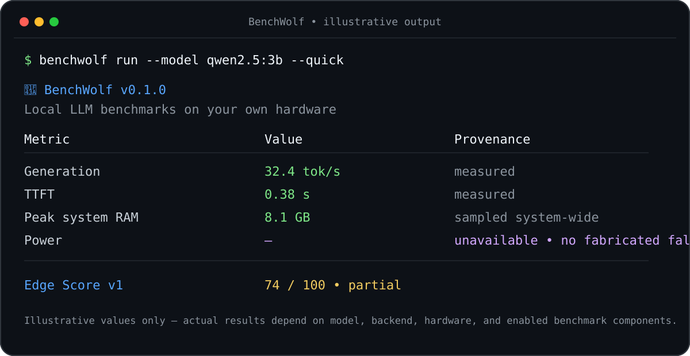

# 🐺 BenchWolf

**Benchmark local LLMs on the hardware you actually own.**

BenchWolf is an open-source CLI for comparing local language-model inference across throughput, latency, system-memory pressure, power, and lightweight quality checks. It targets real developer machines—laptops, desktops, workstations, and edge devices—and records enough provenance to distinguish measurements from estimates.

> **Status:** `0.1.0` alpha. The benchmark protocol and Edge Score are versioned so results can evolve without pretending different methodologies are directly comparable.

<p align="center">
  
</p>

*Illustrative output; benchmark values vary by model, backend, hardware, and enabled components.*

## What it measures

| Area | Metric | Provenance |
|---|---|---|
| Speed | generation tok/s, prompt tok/s, TTFT | measured by backend timings / wall clock |
| Sustained behavior | sustained tok/s and throughput change | measured, heuristic throttle indicator |
| Memory | peak system RAM and inference-time delta | sampled system-wide during generation |
| Power | watts, tok/s/W, energy/token | measured on supported sensors; otherwise clearly estimated |
| Quality | mini-MMLU (100 questions) | measured |
| Code quality | mini-HumanEval (20 problems) | **optional; executes generated Python** |
| Fit check | model RAM fit and expected tok/s | heuristic estimate; no download required |

BenchWolf deliberately does **not** call system-wide RAM delta “model RAM,” and it does not present heuristic power or preflight throughput as measured values.

## Install

BenchWolf requires Python 3.10+ and is available from PyPI:

```bash
python -m pip install benchwolf
```

Optional direct llama.cpp support:

```bash
python -m pip install "benchwolf[llamacpp]"
```

For development from a source checkout:

```bash
git clone https://github.com/chandanpandeys/benchwolf.git
cd benchwolf
python -m pip install -e ".[dev]"
```

The default backend is [Ollama](https://ollama.com/).

## Quick start

```bash
benchwolf preflight
benchwolf run --model qwen2.5:3b
benchwolf compare --models "qwen2.5:3b,gemma3:4b"
benchwolf leaderboard
```

Run a shorter pass:

```bash
benchwolf run --model qwen2.5:3b --quick
```

Run one category only:

```bash
benchwolf run --model qwen2.5:3b --only speed
benchwolf run --model qwen2.5:3b --only power
benchwolf run --model qwen2.5:3b --only quality
```

Export a result:

```bash
benchwolf run --model qwen2.5:3b --export json
benchwolf run --model qwen2.5:3b --export markdown -o result.md
```

## HumanEval security boundary

mini-HumanEval is **disabled by default**. It requires executing Python written by the model being benchmarked. A subprocess timeout and Python isolated mode are useful containment measures, but they are **not a security sandbox**: generated code may still access files, processes, or the network with the permissions of the BenchWolf process.

Enable it only for a model/output you are willing to execute:

```bash
benchwolf run --model qwen2.5:3b --allow-code-execution
```

HumanEval never contributes to Edge Score v1, so leaving this unsafe capability disabled does not penalize the score. See [SECURITY.md](SECURITY.md).

## Edge Score v1

BenchWolf reports a composite 0–100 score to make repeated local comparisons easier. It is a **convenience metric, not a scientific universal ranking**.

| Component | Weight | Full-score requirement |
|---|---:|---|
| generation throughput | 35% | yes |
| TTFT | 10% | yes |
| sustained stability | 5% | yes |
| system RAM headroom | 20% | yes |
| **measured** power efficiency | 15% | yes |
| mini-MMLU | 15% | yes |

If one or more components are missing—or power is estimated rather than measured—BenchWolf still computes a weighted score from available components but labels it **partial**. Partial scores should only be compared with runs using the same protocol/components.

## Power methodology

BenchWolf samples power concurrently with generation.

- **RAPL** on compatible Linux Intel systems: measured energy-counter delta.
- **hwmon** when a usable `power1_input` sensor exists: measured.
- **battery**: may rely on discharge information and is marked estimated.
- **estimate**: CPU-utilization/TDP heuristic and always marked estimated.

BenchWolf never substitutes a made-up 1 W value when a sensor is unavailable. If no useful sample is produced, power metrics are returned as unavailable.

## Memory methodology

BenchWolf samples **system-wide used RAM** roughly every 50 ms while inference runs. This works across backends such as Ollama, where the model may live in a separate process, but it also means unrelated OS/application activity can affect the number. Results therefore use the terms `peak_system_ram` and `inference_delta`, not “model footprint.”

## Preflight methodology

`benchwolf preflight` does not run or download a model. It combines known model-size metadata with detected RAM, coarse memory-bandwidth estimates, CPU/core heuristics, and active-parameter estimates for MoE models. Values shown as `Est. speed` and `ceiling` are planning aids—not benchmark results.

## Result storage

Runs are saved locally under:

```text
~/.benchwolf/results/
```

JSON output includes the BenchWolf version, Edge Score version, whether the score is partial, hardware fingerprint, and measurement provenance.

## Development

```bash
git clone https://github.com/chandanpandeys/benchwolf.git
cd benchwolf
python -m pip install -e ".[dev]"
ruff check src tests
ruff format --check src tests
pytest -q
python -m build
python -m twine check dist/*
```

CI runs linting, tests on Linux/macOS/Windows with Python 3.10–3.12, and a clean wheel-install smoke test.

## License

Apache-2.0. See [LICENSE](LICENSE).
